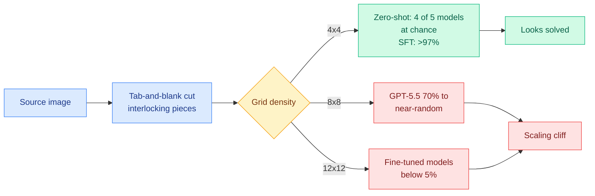

# JigShape: fine-tuning fixes one puzzle size, not the ability to solve puzzles

**arxiv:** [2607.27670](https://arxiv.org/abs/2607.27670)
**Raw:** [raw/huggingface/2026-08-12-jigshape-evaluating-visual-geometric-reasoning-in-vlms-thr.md](../../raw/huggingface/2026-08-12-jigshape-evaluating-visual-geometric-reasoning-in-vlms-thr.md)
**Date:** 2026-08-12

## TL;DR

JigShape is a 95K-instance jigsaw-puzzle benchmark for vision-language models, built with tab-and-blank interlocking pieces rather than the rectangular cuts prior jigsaw benchmarks used. The geometric interlock matters because it removes the ambiguity that rectangular cuts create in texture-repeated regions: with tabs and blanks, only one arrangement is physically valid, so ground truth is unambiguous. Zero-shot results are stark. Across five frontier models on the easiest 4x4 grid, only GPT-5.5 exceeds the random baseline at all, and every other model sits at chance. Supervised fine-tuning then pushes 4x4 above 97%, which looks like the problem is solved, until grid density increases. GPT-5.5 falls from 70% on 4x4 to near-random on 8x8, and even fine-tuned models drop below 5% on 12x12. The authors call this a **scaling cliff** and argue it shows current architectures cannot hold consistent constraint satisfaction as the number of simultaneously-interacting pieces grows.

## Key findings

1. **The geometric constraint is what makes the benchmark honest.** Rectangular-cut jigsaw benchmarks are unfalsifiable in flat regions of an image, because many arrangements are equally consistent with the pixels. Tab-and-blank pieces add a strong local compatibility requirement, so visual content and geometry together pin down exactly one answer. The benchmark design is the contribution as much as the result is.

2. **Zero-shot geometric reasoning is essentially absent.** Only one of five frontier models beats random on the easiest grid. This is not a marginal-performance finding, it is a floor finding: four frontier vision-language models have no measurable ability at the task at all.

3. **The scaling cliff is the result that matters, and it is a warning about fine-tuning.** Supervised fine-tuning takes 4x4 above 97%. If the benchmark had stopped there, the honest-sounding conclusion would have been that the capability was learnable and the zero-shot gap was a prompting problem. It is not. The same fine-tuned models fall below 5% at 12x12, which means fine-tuning taught the models to solve puzzles of a particular size rather than to satisfy interlocking constraints.

4. **The failure grows with the number of interacting constraints, not with the perceptual load.** A 12x12 puzzle is not harder to see than a 4x4 one. What changes is how many pairwise compatibility relations must be held consistent at once.

## Relation to prior wiki state

**This is the fourth entry in a pattern this wiki declared crystallized on 05-17, and it sharpens the diagnosis.** The prior three all argued that vision-language model failures on visually simple tasks are structural rather than perceptual: [CurveBench (05-17)](2026-05-17-curvebench-hierarchical-topological-reasoning.md), which asked models to recover which non-crossing closed curves contain which and found Gemini 3.1 Pro at 71.1% on Easy and 19.1% on Hard for a task humans solve at a glance; WildTableBench (05-15), where only one of 21 frontier models crossed 50% on table reading; and MemEye/MemLens (05-15), where multi-session multimodal performance capped below 30%.

JigShape adds the axis those three did not have. CurveBench showed that RLVR-style fine-tuning of a small open model lifted CurveBench-Easy from 2.8% to 33.3%, exceeding two frontier closed models, and this wiki read that optimistically: the structural gap looked like something post-training could close. JigShape runs the same experiment with a difficulty dial attached and finds the optimism was premature. Fine-tuning closes the gap **at the size it was trained on** and does not transfer up. That is a materially different claim from "the failure is structural," and it is the more useful one, because it says the obvious remedy has a measurable ceiling.

**It also rhymes with a result from a completely different subfield on the same board.** [SPIEval (08-12)](../agentic-systems/2026-08-12-agent-benchmark-cluster.md) found that 79% of mobile-assistant failures are inaccurate information localization, with fewer than 2% of retrieval actions using any advanced search method, meaning agents commit to a plausible guess rather than continuing to verify. A model that guesses a plausible piece placement instead of checking the tab-and-blank fit is doing the same thing in a different modality: accepting a locally-consistent answer without testing it against the constraints it must also satisfy.

## Gaps

The paper reports the cliff but not its cause. There is no ablation separating whether the model fails to represent many simultaneous constraints, fails to search over arrangements, or simply runs out of usable visual resolution per piece as grid density rises, and those three have different fixes. The fine-tuning is standard supervised fine-tuning, so the CurveBench-style RLVR comparison that would test whether verifiable-reward training transfers across grid sizes is missing, which is the single most informative experiment the paper could have run. There is also no human baseline at 12x12, which matters because a 144-piece puzzle is not trivial for a person under time pressure either.

## Links

- [CurveBench: hierarchical topological reasoning](2026-05-17-curvebench-hierarchical-topological-reasoning.md)
- [Agent benchmark cluster (08-12)](../agentic-systems/2026-08-12-agent-benchmark-cluster.md)
- [Daily digest 2026-08-12](../daily-digest/2026-08/2026-08-12.md)
