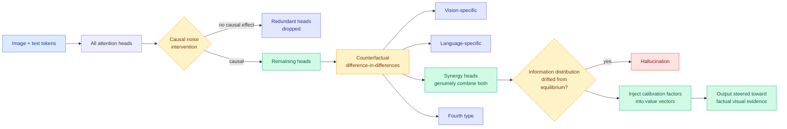

# HEAL: hallucination is not too little visual attention, it is drift inside the heads that combine modalities

**Date:** 2026-09-21
**Topic:** vision-audio-video (with an attention-head routing angle)
**Source:** HuggingFace Daily Papers · [arXiv 2609.09206](https://arxiv.org/abs/2609.09206) · [raw](../../raw/huggingface/2026-09-21-mllms-hallucinate-when-information-distribution-drifts-in-sy.md)

---

## TL;DR

The standard story about multimodal hallucination is that the model stops looking at the image, so
the fix is to push more attention onto visual tokens. HEAL reports that this story points at the
wrong quantity. Attention weights are an **indirect signal** and do not track the information shift
that actually accompanies a hallucination. HEAL instead does causal noise intervention on multi-head
outputs to drop heads that are causally redundant, then uses a counterfactual **difference-in-differences**
estimator to disentangle how information is distributed inside the remaining heads, sorting them
into four types. The finding: **hallucinations occur when the information distribution inside
synergy heads, the heads that genuinely combine visual and textual information, drifts away from a
healthy equilibrium.** It is not correlated with how many modality-specific heads there are or how
strongly they fire. The fix follows directly: inject dynamic calibration factors into the **value
vectors** of synergy heads at inference, steering the output back toward the visual evidence. No
retraining.

---

---

## Why an efficiency reader should care about a hallucination paper

Three reasons, all about the head axis rather than the multimodal application.

**It is a head-level router, built with a causal criterion.** [MISA, the mixture-of-indexer sparse
attention (05-11)](../inference-efficiency/2026-05-11-misa-mixture-of-indexer-sparse-attention.md)
established the head axis as a routing axis: different heads want different sparsity patterns, so
select per head. Everything since has selected heads by correlational scores, usually attention
mass or activation magnitude. HEAL's contribution to that thread is the **selection criterion**: it
drops heads by intervening and checking whether output changes, not by reading off a weight. The
paper's framing that attention weights "fail to accurately reflect the actual information shift" is
a direct criticism of how most head-pruning and head-routing work picks its heads, and it is
testable outside multimodal settings.

**Four head types is a taxonomy that transfers.** Vision-specific, language-specific, synergy and a
fourth category is a partition of the head space by function rather than by layer index. Any
head-axis compression scheme needs exactly this: which heads can be pruned, which can be quantized
harder, and which are load-bearing. If the synergy heads are the ones carrying the cross-modal
binding, they are the ones a KV-cache quantizer should protect, and nobody has run that experiment.

**The fix is a value-vector edit at inference.** Injecting calibration factors into value vectors is
cheap, needs no retraining, and composes with anything that does not rewrite the values. It is the
same class of intervention as the paired activation steering in [today's scientific-judgment
collapse paper](../responsible-ai/2026-09-21-scientific-judgment-collapse.md), and both are
distributional corrections applied at inference rather than fixes applied to weights.

---

## Relation to prior wiki pages

**Confirms the head axis and changes how to select on it.** MISA (05-11) opened the head axis for
routing. [VC-Attention (09-17)](../inference-efficiency/2026-09-17-vc-attention-low-bit-value-smoothing.md)
found that value outliers in video diffusion transformers are token-structured rather than
channel-structured, which is why channel transforms never fixed them, and its fix also operates on
the value side. HEAL is a third result saying the **value path** is where the useful structure is,
and the second in five days to fix a problem by editing values rather than by reweighting attention.
Three papers now pointing at the values is the threshold at which this wiki should treat it as a
pattern: **the attention weights are the diagnostic everyone reads and the values are where the
information actually is.**

**Contradicts the prevailing mitigation family.** Most attention-based hallucination mitigation
amplifies attention to visual tokens. HEAL reports that neither the count nor the strength of
modality-specific heads correlates with hallucination. If that replicates, a body of work is
optimizing a quantity that does not cause the outcome.

---

## Gaps

- **"Four types" with only three named.** The abstract names the categorisation but only makes the
  synergy category do work. What the fourth type is and whether the partition is stable across
  models is not established.
- **No efficiency numbers.** Causal noise intervention across all heads is a sweep, and the paper
  reports it as an analysis method rather than pricing it. If the head taxonomy has to be recomputed
  per model, that is a one-time cost worth knowing.
- **The equilibrium is descriptive.** "Drifts away from a healthy equilibrium" implies a reference
  distribution, and where that reference comes from, and whether it is per-model or per-input,
  determines whether this is a deployable detector or only a post-hoc explanation.

---

## Related pages

- [MISA: mixture-of-indexer sparse attention (05-11)](../inference-efficiency/2026-05-11-misa-mixture-of-indexer-sparse-attention.md)
- [VC-Attention: low-bit value smoothing (09-17)](../inference-efficiency/2026-09-17-vc-attention-low-bit-value-smoothing.md)
- [Scientific-judgment collapse (09-21)](../responsible-ai/2026-09-21-scientific-judgment-collapse.md)
- [LLM routing](../ai-routing/llm-routing.md)
